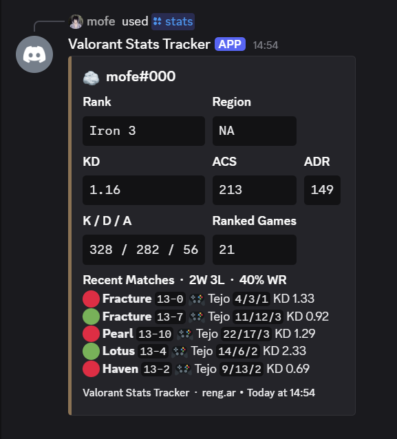
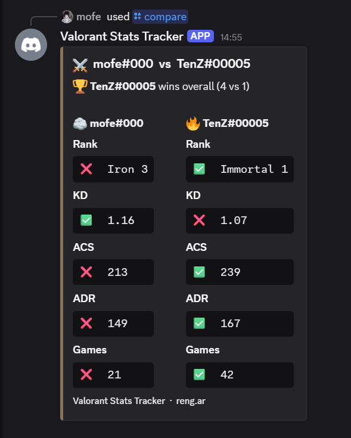
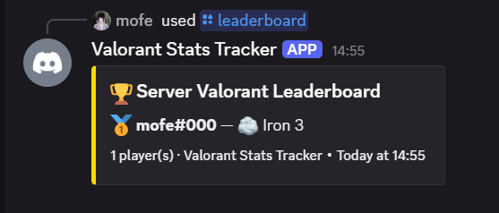
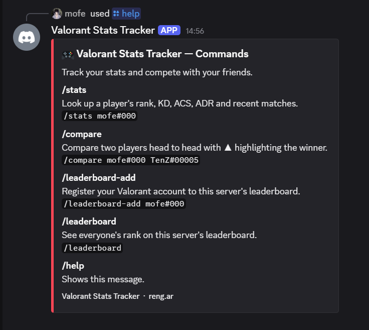

# 🎮 Valorant Stats Tracker — Discord Bot


A Discord bot that lets players look up live Valorant stats, compare with friends, and track a server leaderboard — all through slash commands. Deployed 24/7 on Railway.

---

## 📸 Preview

### `/stats` — Player stats with recent match history


### `/compare` — Head to head comparison


### `/leaderboard` — Server leaderboard


### `/help` — All commands


---

## ✨ Commands

| Command | Description |
|---|---|
| `/stats Name#Tag` | Rank, KD, ACS, ADR and last 5 matches with map, agent, W/L |
| `/compare Name#Tag Name#Tag` | Head to head with ✅ ❌ stat winners and overall winner |
| `/leaderboard-add Name#Tag` | Register your Valorant account to this server's leaderboard |
| `/leaderboard` | See the server's ranked leaderboard |
| `/leaderboard-remove` | Remove yourself from the leaderboard |
| `/help` | All available commands |

---

## 🛠 Tech Stack

- **Python 3.11** — core language
- **discord.py 2.3** — slash commands, embeds, Cog architecture
- **aiohttp** — async HTTP requests to the Valorant API
- **aiosqlite** — async SQLite database for leaderboard persistence
- **asyncio.gather()** — concurrent API calls for fast responses
- **python-dotenv** — secure token management via environment variables
- **Rengar API** — free Valorant API, no auth required (reng.ar)
- **Railway** — 24/7 cloud deployment with GitHub CI/CD

---

## 🚀 Running Locally

### 1. Clone the repo
```bash
git clone https://github.com/sandivinity/valorant-bot.git
cd valorant-bot
```

### 2. Install dependencies
```bash
pip install -r requirements.txt
```

### 3. Create a `.env` file
```
DISCORD_TOKEN=your_token_here
```

### 4. Run the bot
```bash
python main.py
```

---

## 📁 Project Structure

```
valorant-bot/
├── main.py                  # Bot startup, initializes DB and agent cache
├── requirements.txt
├── Procfile                 # Railway deployment config
│
├── commands/
│   ├── stats.py             # /stats command
│   ├── leaderboard.py       # /leaderboard commands
│   ├── compare.py           # /compare command
│   └── helpcmd.py           # /help command
│
└── utils/
    ├── api.py               # Valorant API calls + agent UUID cache
    ├── embeds.py            # Discord embed builders
    └── database.py          # SQLite database layer
```

---

## 🧠 Key Concepts

- **Async/Await** — non-blocking API calls so the bot never freezes
- **Discord Cogs** — modular command architecture
- **Concurrent requests** — `asyncio.gather()` fires multiple API calls simultaneously
- **SQLite** — real persistent database storage with `aiosqlite`
- **Agent UUID resolution** — fetches and caches agent names from valorant-api.com on startup
- **Environment variables** — secure token management, never hardcoded

---

## 📝 License

MIT — free to use, modify, and distribute.

---

> Built by [divinity](https://github.com/sandivinity) — 1st year Software Engineering student 🎓
